## Introduction {#sec-intro}

Data science  majors popularity is at an all time high [@Pierson:2023], leading to strain on teaching resources.
The increased enrollment, even in upper level undergraduate courses, increases the time spent on class management by instructors and limits their ability and that of teaching assistants to provide timely feedback on evaluations.
The advent of generative artificial intelligence (genAI) also raises concerns about plagiarism.
Due to these, instructors more and more default back to invigilated multiple choice exams.
This is unfortunate because the questions that can be asked in such evaluations are not necessarily authentic.

Data science is interdisciplinary by nature: standard tasks performed by analysts include exploratory data analysis and data wrangling, visualisation, model specification, estimation and validation, along with reporting.
Designing assignments should therefore try to emulate those tasks while fostering statistical thinking [@Woodard.Lee.Woodard:2020].
For formative and summative assessment, it is often beneficial to have clear and consistent grading rubrics, which facilitate learning experience [@Poulos.Mahony:2008].
Automating feedback by parsing code, and using natural language processing (NLP) for comments can lead to efficiency gains [@Galassi.Vittorini:2021], while software solutions which facilitate sharing of grading rubrics, such as e.g. and Otter-Grader [@ottergrader:2025], ensure some consistency across instructors.
Version control is now often covered as part of the content in an introductory data science courses [e.g., @Timbers.Campbell.Lee:2022], and it is also becoming more frequent for class management [@ghclass;@Ricci.Medina.Dogucu:2024].
Solutions such as WebWork [@Berkova.Nemec:2020;@Zimmerman:2020] or R-exams [@Zeileis.Umlauf.Leisch:2014] give instructors tools to effectively manage large-scale assessments using randomized questions databases.
The automation of many of these grading and feedback tasks remains difficult because, while there are wrong answers, there is no unique correct one.
Thus, setting up rubrics requires much upfront work to determine most likely errors.


Our purpose is to review software tools for teaching, assessing and grading data analysis skills in the classroom using the **R** programming language [@Rlang], a widely-used interpreted language which is popular among statisticians.
There exists a wealth of contributed packages and software bundles to encourage semi-automation of tasks, generation of randomized evaluations, and tutorials.
One key point is keeping the technical barriers low also for instructors, who can easily adapt their existing examples to a more interactive format.
We consider several examples, notably:

- In-class activities with limited entry-level barriers to programming via [`webR`](https://docs.r-wasm.org/webr/latest/) coupled with [Quarto Live](https://r-wasm.github.io/quarto-live/);
- Interactive tutorials via the `learnR` [@learnr;@Stoudt.Scotina.Luebke:2022] package, including description of randomization within, with gradated hints and support for multiple solutions [`gradethis`](https://pkgs.rstudio.com/gradethis/) and recovery of student responses using [`submitr`](https://dtkaplan.github.io/submitr/articles/using.html) or [`learnhash`](https://github.com/rundel/learnrhash).
- Semiautomatic tools for extracting student solutions for coding tasks and autograding, focusing on invariance of outputs.

The purpose of this paper is to review these three aspects critically with different points in mind and to


- Introduce, review and highlight these tools (e.g., limitations in `learnr` for randomization due to pre-rendering)
- Suggest strategies for building unit tests and enabling informative feedback
- Streamline the use of these tools by providing templates for users
- \hl{Report on instructors experience implementing these tools in their classroom during the 2025--2026 academic year ???}.

The remainder of the paper is organized as follows:
@sec-tools compares the main tools;
@sec-webr describes an open course skeleton built with webR [@cancotsrepo], its requirements and an example of auto-graded exercises, and @sec-strengths summarizes its strengths and limitations;
@sec-learnr and @sec-autograde discuss `learnr` tutorials and the autograding of R Markdown and Quarto documents, @sec-design gives recommendations for designing tutorials and checks, and @sec-evidence reviews evidence from the classroom;
@sec-discussion concludes with a discussion, 
and @sec-llm \hl{briefly describes a possible extension using large language models [Should we include this?]}


## Tools for interactive R tutorials {#sec-tools}

### Description of tools

+-----------------+--------------------------------+--------------------------------+--------------------------------+
| Tool            | Description                    | Hosting                        | Related packages               |
+=================+================================+================================+================================+
| `webR`          | A version of R compiled for    | Can work with static web       | Useful for lightweight,        |
|                 | the browser and Node.js using  | hosting because computation    | browser-based R interactivity. |
|                 | WebAssembly. It allows R code  | happens client-side, although  | It is conceptually different   |
|                 | to run in the user's browser   | package support depends on     | from standard `learnr`, which  |
|                 | without an R server            | WebAssembly- compatible R      | usually depends on Shiny.      |
|                 | [@webRdocs].                   | packages [@webRpackages;       |                                |
|                 |                                | @webRdocs].                    |                                |
+-----------------+--------------------------------+--------------------------------+--------------------------------+
| `learnr`        | An R package for turning R     | Standard `learnr` tutorials    | Provides the tutorial          |
|                 | Markdown documents into        | use `runtime:                  | framework that can incorporate |
|                 | interactive tutorials with     | shiny_prerendered`, so they    | `gradethis` feedback and, in   |
|                 | narrative, code exercises,     | usually need to run locally or | some workflows, `learnrhash`   |
|                 | quizzes, videos, and Shiny     | on a Shiny-capable hosting     | tracking.                      |
|                 | components [@learnr].          | platform rather than as        |                                |
|                 |                                | ordinary static pages          |                                |
|                 |                                | [@learnr].                     |                                |
+-----------------+--------------------------------+--------------------------------+--------------------------------+
| `gradethis`     | An R package that provides     | Its deployment constraints     | Extends `learnr` by adding     |
|                 | automated feedback for student | generally follow `learnr`,     | automated feedback to code     |
|                 | exercises in `learnr`          | since it is designed to run    | exercises.                     |
|                 | tutorials. It can compare      | inside `learnr` tutorials      |                                |
|                 | student code to a model        | [@gradethis].                  |                                |
|                 | solution or use custom grading |                                |                                |
|                 | logic [@gradethis].            |                                |                                |
+-----------------+--------------------------------+--------------------------------+--------------------------------+
| `Quarto`        | An open-source scientific and  | Can produce static HTML        | Useful for publishing course   |
|                 | technical publishing system    | outputs that are suitable for  | materials, while `learnr` is   |
|                 | for documents, websites,       | static hosting; dynamic or     | more specialized for           |
|                 | blogs, books, presentations,   | live interactive content may   | interactive tutorials.         |
|                 | dashboards, and other outputs  | require an appropriate runtime |                                |
|                 | [@quarto].                     | or hosting environment         |                                |
|                 |                                | [@quarto].                     |                                |
+-----------------+--------------------------------+--------------------------------+--------------------------------+
| Other tools     | Tools discussed elsewhere in   | The Quarto extensions support  | The Quarto extensions build on |
|                 | this paper: the Quarto         | static hosting. `learnrhash`   | `webR`; `learnrhash` and       |
|                 | extensions `quarto-webr`       | and `submitr` require Shiny,   | `submitr` extend `learnr`;     |
|                 | [@quartowebr] and              | as for `learnr`. WeBWorK       | Otter-Grader supports R        |
|                 | `quarto-live` [@quartolive];   | requires its own server; the   | through `ottr`.                |
|                 | `learnrhash` and `submitr` for | remaining tools run on the     |                                |
|                 | collecting `learnr` responses; | instructor's machine.          |                                |
|                 | R-exams and WeBWorK for        |                                |                                |
|                 | randomized assessments;        |                                |                                |
|                 | Otter-Grader and `ghclass` for |                                |                                |
|                 | autograding and class          |                                |                                |
|                 | management.                    |                                |                                |
+-----------------+--------------------------------+--------------------------------+--------------------------------+

: Description of the main tools reviewed in this paper. {#tbl-tools}


### Use cases

+-------------+----------------------+----------------------+----------------------+
| Tool        | Use case summary     | Strengths            | Limitations /        |
|             |                      |                      | comparison           |
+=============+======================+======================+======================+
| `webR`      | Use when students    | Strong for static or | Less mature than     |
|             | need to run R code   | mostly-static        | standard server-side |
|             | directly in the      | websites because     | R workflows. The API |
|             | browser without      | computation happens  | is under active      |
|             | installing R or      | client-side. Useful  | development, some    |
|             | connecting to an R   | for lightweight      | packages may not     |
|             | server               | browser-based coding | work, and mobile     |
|             | [@webRdocs].         | activities, demos,   | browsers may have    |
|             |                      | and interactive      | memory limits        |
|             |                      | examples.            | [@webRdocs].         |
|             |                      |                      | Compared with        |
|             |                      |                      | `learnr`, it is      |
|             |                      |                      | better for static    |
|             |                      |                      | hosting but less     |
|             |                      |                      | specialized for      |
|             |                      |                      | structured tutorials |
|             |                      |                      | and feedback.        |
+-------------+----------------------+----------------------+----------------------+
| `learnr`    | Use when you want a  | Strong for           | Standard `learnr`    |
|             | guided interactive   | self-paced active    | tutorials use        |
|             | tutorial with        | learning. Gives      | `runtime:            |
|             | narrative, editable  | students a           | shiny_prerendered`,  |
|             | code exercises,      | structured           | so they usually need |
|             | quizzes, videos, and | environment where    | a Shiny-capable      |
|             | Shiny components     | they read, run code, | environment rather   |
|             | [@learnr].           | answer questions,    | than ordinary static |
|             |                      | and receive          | hosting [@learnr].   |
|             |                      | feedback. Works well | Compared with        |
|             |                      | with `gradethis`.    | Quarto, it is more   |
|             |                      |                      | specialized for      |
|             |                      |                      | tutorials but less   |
|             |                      |                      | general for course   |
|             |                      |                      | websites, slides,    |
|             |                      |                      | books, or reports.   |
+-------------+----------------------+----------------------+----------------------+
| `gradethis` | Use when you want    | Strong for formative | It is not a general  |
|             | automated feedback   | assessment. Can      | publishing tool or a |
|             | on student code      | compare student code | standalone           |
|             | inside a `learnr`    | to a model solution  | assessment system.   |
|             | tutorial             | or use custom        | Its use is closely   |
|             | [@gradethis].        | grading logic, which | tied to `learnr`, so |
|             |                      | helps give targeted  | its hosting          |
|             |                      | feedback for common  | constraints usually  |
|             |                      | mistakes             | follow `learnr`.     |
|             |                      | [@gradethis].        | Compared with        |
|             |                      |                      | `learnr`, it is not  |
|             |                      |                      | the tutorial         |
|             |                      |                      | framework itself; it |
|             |                      |                      | is the feedback      |
|             |                      |                      | layer.               |
+-------------+----------------------+----------------------+----------------------+
| `Quarto`    | Use when you want to | Strong for           | It is not primarily  |
|             | create course notes, | publishing. Supports | an interactive       |
|             | reports, slides,     | multiple languages,  | tutorial or grading  |
|             | websites, blogs,     | including R, Python, | system. Static       |
|             | books, dashboards,   | Julia, and           | outputs are easy to  |
|             | or other             | Observable, and can  | host, but live       |
|             | reproducible         | produce many output  | computation or rich  |
|             | teaching materials   | formats such as      | interactivity may    |
|             | [@quarto].           | HTML, PDF, Word,     | require additional   |
|             |                      | slides, websites,    | tools or hosting.    |
|             |                      | and books            | Compared with        |
|             |                      | [@quarto].           | `learnr`, Quarto is  |
|             |                      |                      | broader and better   |
|             |                      |                      | for publishing;      |
|             |                      |                      | `learnr` is better   |
|             |                      |                      | for guided coding    |
|             |                      |                      | tutorials.           |
+-------------+----------------------+----------------------+----------------------+

: Use cases, strengths and limitations of each tool. {#tbl-usecases}


## An Introduction to running R in the browser using webR {#sec-webr}


### A Course Template for Beginners

At the 2025 Canadian Conference on Teaching Statistics (CanCOTS, Montréal, 10--12 June 2025), the interactive tutorials working group assembled a template for a complete course in which every interactive component runs R in the student's browser [@cancotsrepo].
The template is a Quarto website [@quarto] consisting of a landing page, a syllabus, lecture slides, simulation activities, tutorials and a graded tutorial, and is published with GitHub Pages.
Instructors may fork the repository, replace the content with their own and publish their copy in the same manner.

The materials in the template were contributed by several of the authors: the course skeleton and lecture slides by I. Vrbik, the activities and simulations by K. Cupido, and the tutorials by N. Mudalige.
The graded tutorial shown in Figures [-@fig-exercise] to [-@fig-false-positive] is taken from the STA258 tutorial website at the University of Toronto Mississauga (<https://nishanmudalige.github.io/STA258_Tutorials/>), developed by N. Mudalige.
The remaining screenshots were taken from the live template site in a desktop browser.

### How webR works {#sec-webr-how}

webR is a version of the R interpreter compiled to WebAssembly, a binary format executed by modern web browsers [@webRdocs].
When a page is opened, the browser downloads the webR runtime, starts an R session and installs the packages declared by the page.
Packages must be compiled to WebAssembly; a public repository provides builds for a large share of CRAN, and other packages can be compiled with `rwasm` [@webRpackages].
Since all computation takes place on the student's device, the server only delivers static files, and any static host is sufficient.

webR is embedded in documents through Quarto extensions that convert code chunks into editable cells with a "Run Code" button.
The template uses two such extensions:

- `quarto-webr` [@quartowebr] provides `{webr-r}` cells for HTML documents and revealjs slides, and is used for the slides, activities and ungraded tutorials.
  Packages are declared in the YAML header of each page (such as in @lst-webr-yaml), and chunk options determine whether a cell runs automatically (`autorun`) or prepares the session (`context: setup`).
- `quarto-live` [@quartolive] provides the `live-html` format with `{webr}` cells and supports exercises with hints, solutions and checks written with `gradethis` [@gradethis].
  It is used for the graded tutorial.

```{#lst-webr-yaml .yaml lst-cap="YAML header of a page in the template that uses the quarto-webr extension. The webr filter enables interactive R cells, and the listed packages are installed in the browser when the page is opened."}
format:
  html:
    toc: true
filters:
  - webr
webr:
  packages: ["tibble", "ggplot2"]
```

Both extensions are included in the repository, so no further installation is needed to render the site.

### Requirements {#sec-webr-req}

Instructors require R and Quarto (and optionally RStudio) to edit and render the materials, and a GitHub account or another static host to publish them.
No Shiny server is involved.
Students require only a recent desktop web browser and an internet connection; no software or account is needed.
On the first visit, the browser downloads the R runtime and the packages.
In our tests, the coin-flipping activity downloaded approximately 55 MB and was ready after approximately 20 seconds, whereas the graded tutorial, which also loads `gradethis`, required approximately one minute.
These times depend on the network and the device.
Loading progress is displayed on each page (@fig-loading), and mobile browsers may have insufficient memory for larger pages [@webRdocs].

::: {#fig-loading layout-ncol=2}

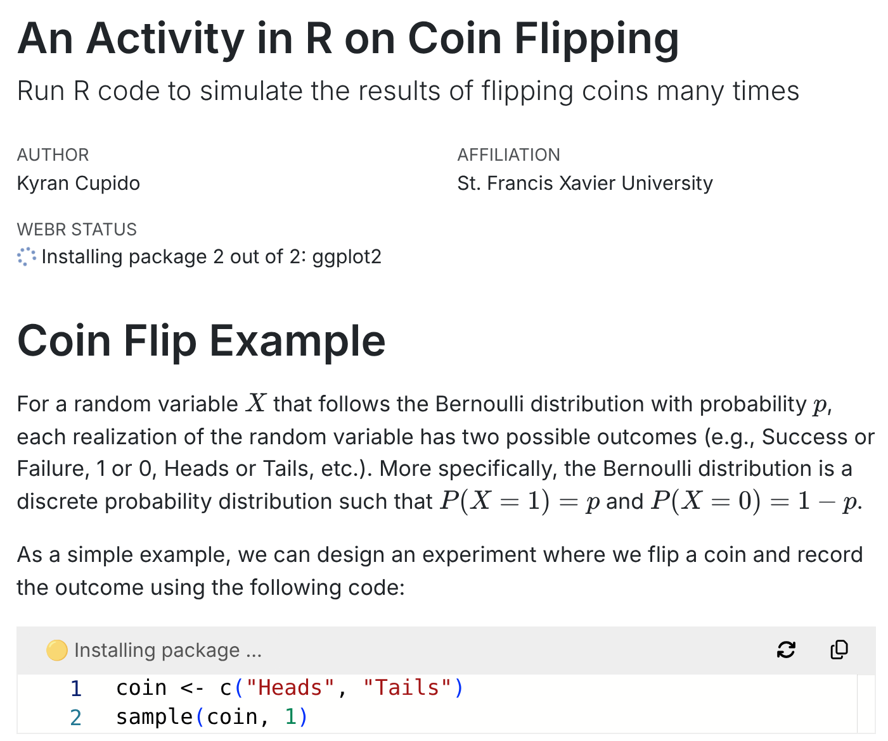{#fig-loading-a}

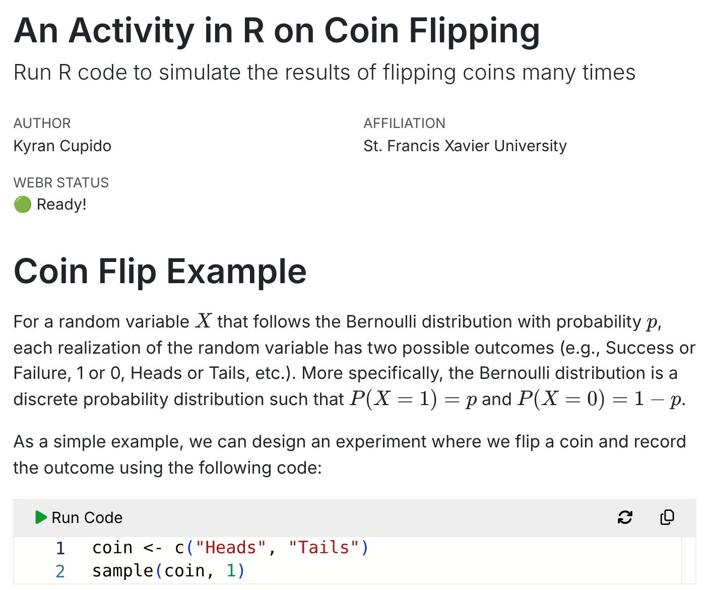{#fig-loading-b}

The coin-flipping activity (a) while webR installs the declared packages and (b) once the R session is ready.
:::

### Structure of the template {#sec-webr-structure}

The landing page (@fig-landing) links to the syllabus and to schedules of lecture slides, activities and tutorials.
Each item is a separate Quarto document, so weeks are added or removed by editing a table.

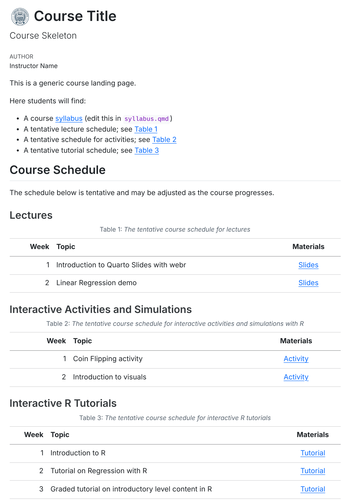{#fig-landing width="65%"}

**Lecture slides.**
The slides are revealjs presentations with embedded `{webr-r}` cells, which allow code to be run and modified during the lecture without leaving the slides (@fig-slide).
The same deck can be printed to PDF.

{#fig-slide width="80%"}

**Activities and simulations.**
Activities combine short explanations with code cells that students modify and re-run.
The coin-flipping activity builds up to a simulation of the running proportion of heads (@fig-activity-a), and the Pixar activity uses the `pixarfilms` package for descriptive statistics and basic graphs (@fig-activity-b).

::: {#fig-activity layout="[[47,53]]" layout-valign="bottom"}

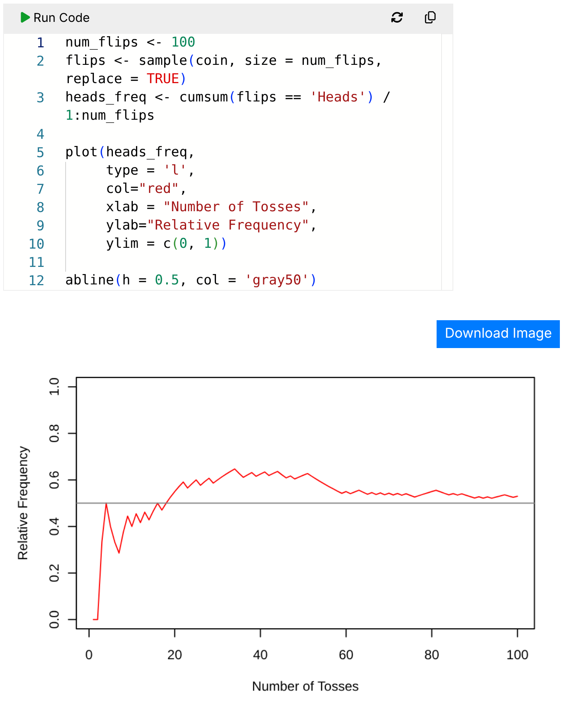{#fig-activity-a}

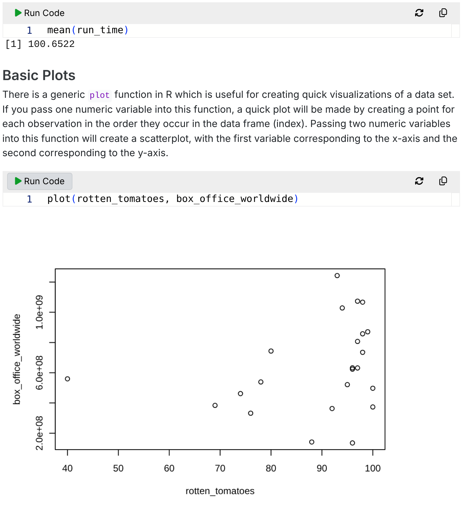{#fig-activity-b}

Code cells from the two activities after running the code.
:::

**Tutorials.**
The ungraded tutorials follow a worked-example format.
In the regression tutorial, students explore the Palmer penguins data [@palmerpenguins] and fit a simple linear regression with `lm()` (@fig-tutorial).
The R session persists across the cells of a page, as in an ordinary R script.

{#fig-tutorial width="55%"}

### Example of use: graded exercises {#sec-webr-exercises}

Each exercise in the graded tutorial consists of up to five chunks that share an `exercise` label: an optional setup chunk, the starting code, a hint, a model solution and a check.
@lst-ex-sum shows the source of the first exercise, which asks students to replace two blanks so that an expression evaluates to 10.
The blanks are written with a full-width underscore character (＿), which the setup chunk defines as a missing value.

````{#lst-ex-sum .markdown lst-cap="Quarto source of the first exercise of the graded tutorial, consisting of a setup chunk, the starting code, a hint, a model solution and a check written with gradethis."}
```{webr}
#| setup: true
#| exercise: ex_sum
＿ <- NA_real_
```

```{webr}
#| exercise: ex_sum
1 + 2 + ＿ + ＿
```

::: {.hint exercise="ex_sum"}
Replace the two ＿ with 2 numbers that add up to 7.
:::

::: {.solution exercise="ex_sum"}
```{webr}
#| exercise: ex_sum
#| solution: true
1 + 2 + 3 + 4
```
:::

```{webr}
#| exercise: ex_sum
#| check: true
gradethis::grade_this({
  if (grepl("＿", .user_code, fixed = TRUE)) {
    fail("Replace ＿ with a number.")
  }
  if (is.numeric(.result) && length(.result) == 1 &&
      isTRUE(all.equal(.result, 10))) {
    pass("✅ Correct!")
  } else {
    fail("Not quite — try to make the expression evaluate to 10.")
  }
})
```
````

Within `grade_this()`, the check has access to the student's code as text (`.user_code`), the value of the last expression (`.result`) and the evaluation environment (`.envir_result`), and returns feedback through `pass()` or `fail()`.
Checks are therefore ordinary R code.
Running the code displays its output followed by the feedback from the check (@fig-exercise).
Once the hint has been revealed, the hint button is replaced by a "Show Solution" button, so that assistance is provided in stages.

::: {#fig-exercise layout-nrow=2}

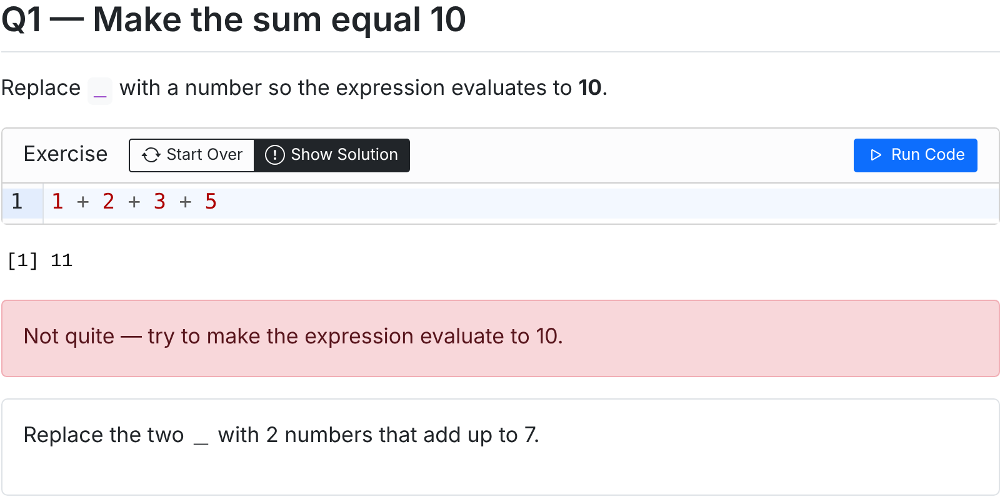{#fig-exercise-a}

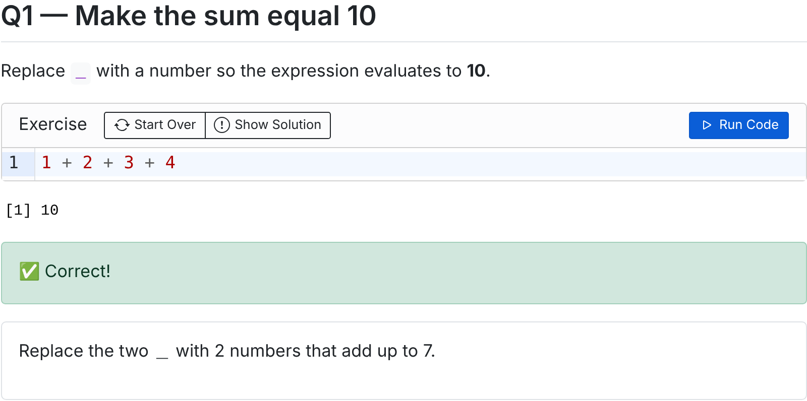{#fig-exercise-b}

The first exercise of the graded tutorial, with (a) an incorrect answer and the hint and (b) the corrected answer.
:::

Later exercises inspect the code itself.
For a question requiring a histogram of one column of `ToothGrowth`, the check parses the submission with `parse()` and verifies that it is a single call to `hist()` with an admissible argument, which allows targeted messages for anticipated mistakes (@fig-solution).
R errors are displayed in the cell as in an ordinary R session (@fig-error).

{#fig-solution width="65%"}

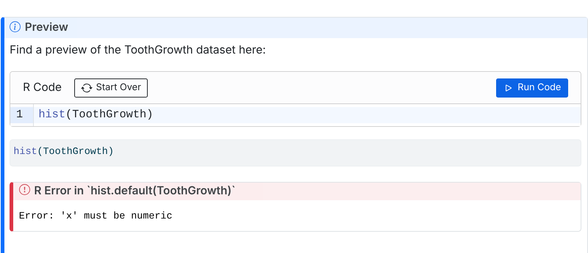{#fig-error width="65%"}

Checks may also be too permissive.
The third exercise asks for the mean of `c(2, 4, 6, 8, 10)`, but the check only compares the stored value with 6, so the median of a different vector is accepted (@fig-false-positive).
Checks that compare values should therefore anticipate incorrect approaches, for instance by also inspecting the code for a call to `mean()`; we return to this point in @sec-design.

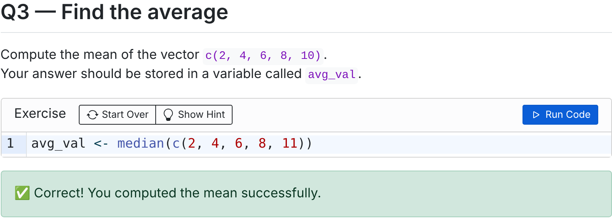{#fig-false-positive width="65%"}


## Strengths and limitations of the webR approach {#sec-strengths}

The main strength of the approach is that students can run R without installing software, which removes a frequent source of difficulty at the start of a course and on restricted machines.
Instructors write materials in Quarto or R Markdown, a single source can produce slides, notes and exercises, and hosting is free and requires no server administration.
Exercises provide immediate feedback, and since checks are written in R, the feedback can be tailored to anticipated mistakes.
The approach is therefore well suited to live demonstrations, in-class activities and simulations, pre-lab preparation and low-stakes self-assessment.

Without additional infrastructure, the approach has the following limitations.

- *Summative assessment.*
  Solutions are embedded in the page source, and the checks are sent to the browser, where grading takes place.
  Students who inspect the page can therefore obtain the answers.
- *Recording student work.*
  Results are displayed to the student but are neither stored nor transmitted to the instructor, and there is no integration with a learning management system.
- *Persistence.*
  In our tests, edits to exercises were lost when the page was reloaded.
- *Packages and computation.*
  Only packages with WebAssembly builds are available, and computations run on the student's device, which limits the size of data and the computational load.
- *Interactive features.*
  On hosts that do not send specific HTTP headers, such as GitHub Pages, functions requiring keyboard input (e.g., `readline()` or the debugger) are unavailable.
- *Layout.*
  Wide output may be truncated (@fig-tutorial) and tall plots may overflow slides (@fig-slide).
- *Maturity.*
  webR and both extensions are under active development [@webRdocs], and the two extensions use different chunk syntax.


## Interactive tutorials for learning and assessment using `learnR` {#sec-learnr}

### Main initial takeaways

- Best use is for interactive, low stakes tutorials.
- Supports active learning since students learn by running code.
- Good for formative assessment: useful for practice, readiness checks, lab prep, and review rather than formal high-stakes grading.
- Works best for smaller code tasks to simplify feedback through `gradethis`.
- Immediate feedback is available with `gradethis`.
- Student work can be tracked easily through `learnrhash`, as long as you need an existence proof and not a formal evaluation.
- The choice of hosting matters.
  Static tutorial `learnr` tutorials materials or pre-rendered R Markdown pages can be shared through GitHub Pages, but standard live interactive `learnr` tutorials require a Shiny-capable environment.

Some issues to think about:

- There are scoping issues which require careful planning when designing tutorials.
- Security is potentially an issue with regards to what you can do, particularly if you are serving the learnr tutorial from a server.
- It requires work to convert output from `learnr` hash into readable content for more formal grading.
- For questions where the next part of a question depends on the previous part, you should give the student the answer.
- `learnrhash` relies on Shiny server logic to collect the tutorial state and generate the copy-paste hash (`learnrhash` can not be implemented on GitHub pages as far as I am aware)

## Autograding of code chunks from Rmarkdown and Quarto documents {#sec-autograde}


## Designing tutorials and assessment {#sec-design}

In the following section, we focus on some elements that are idiosyncratic to **R**, although much of the discussion has similar implications for any other programming language.

- A simple way of getting around the cheating problem is through individualized data generation for which the procedure/script remains the same but answers differ.
  Of course, the drawback of this choice is that scripts could be shared between students.
  In data analysis problems, it is also possible to randomize the order of covariates, their name and their selection.
- Asking the right questions: determining the variables and setup (e.g., test statistic, one-sided versus two-sided test, confidence level, conclusion) that can be randomized.
- Generating context using generative AI.
- Validating the results (e.g., numerical tolerance to rounding, differences for p-values for one-sided versus two-sided).


Summative assessment of student answers

- Open-ended questions are best checked through multiple choice questions that force users to generate plots or look at summary statistics and model output.
- Focus on invariants and account for students degrees of freedom: e.g., in regression models, we can't check formulas because variable names may differ following data wrangling, the syntax and order of variables may be different (in **R** formula notation, `a*b` versus `b + a + a:b`).
  Likewise, contrast specification may change, as is the default engine class (e.g., `lm`  vs `glm` with `family=gaussian`) for fitting these models.
  We can however compare sample sizes, span of projection (hat) matrices, linear contrasts, tests comparing nested models, residuals and predictions, etc.
- Depending on how prescriptive instructors are (for example, with naming of variables during tidying setup), we can validate more output.
- Conversely, checks that only compare a final value can accept incorrect reasoning when a wrong approach happens to produce the same number, as in the example of @fig-false-positive.
  Combining a check on the value with a check on the code (e.g., the functions called), or choosing inputs for which common mistakes give distinct answers, reduces such false positives.

Students could simply save certain objects as lists and submit a .RData or a CSV file with their short answer.
Automated checks can verify class or attributes, and check existence of the variable names; settings may also be set so that the environment is saved at the end of each question.
This requires that the answers be numerical, or TRUE/FALSE.
If the inputs are randomized, the instructor must run every data version to compare student answers with the solution key.

If students submit a Quarto file that generates an html/PDF report.
consider chopping a Quarto file with headers defining questions and sub-questions to facilitate extraction of code or run a text parser to extract comments or text.


\blandscape

## Evidence from the classroom {#sec-evidence}

:::{.callout-caution}
The list below has not been thoroughly checked and is not exhaustive.
:::


### `learnr`

+---------------------------------------+--------------------------------+--------------------------------------+-----------------------------------------------------------+
| Source                                | Evidence type                  | Classroom / teaching context         | Summary                                                   |
+=======================================+================================+======================================+===========================================================+
| Stoudt, Scotina, & Luebke,            | Peer-reviewed education        | Statistics and data science          | Discusses classroom uses of `learnr` tutorials for        |
| “Supporting Statistics and Data       | article                        | education                            | statistics and data science instruction.                  |
| Science Education with learnr”        |                                |                                      |                                                           |
| [@Stoudt.Scotina.Luebke:2022]         |                                |                                      |                                                           |
+---------------------------------------+--------------------------------+--------------------------------------+-----------------------------------------------------------+
| Engels, Grosjean, & Artus,            | Peer-reviewed classroom        | Biology students learning data       | Analyzes three years of course data and describes         |
| “Teaching data science to students    | study                          | science                              | `learnr` tutorials as part of the course design.          |
| in biology using R, RStudio and       |                                |                                      |                                                           |
| Learnr” [@engels2023learnrbiology]    |                                |                                      |                                                           |
+---------------------------------------+--------------------------------+--------------------------------------+-----------------------------------------------------------+
| Aberson, “Building Interactive        | Peer-reviewed teaching         | Psychological statistics             | Describes building online interactive tutorials with      |
| Tutorials for Teaching Psychological  | article                        |                                      | videos, quizzes, and R analysis space using `learnr`.     |
| Statistics Online with learnr”        |                                |                                      |                                                           |
| [@aberson2021learnrpsych]             |                                |                                      |                                                           |
+---------------------------------------+--------------------------------+--------------------------------------+-----------------------------------------------------------+
| Stoudt, “Using learnr Tutorials in    | Instructor classroom report /  | Introductory statistics pre-labs     | Practical classroom account of using `learnr` tutorials   |
| an Intro Stats Class as Pre-Labs”     | blog                           |                                      | before lab sessions. Not peer-reviewed.                   |
| [@stoudt2021introprelabs]             |                                |                                      |                                                           |
+---------------------------------------+--------------------------------+--------------------------------------+-----------------------------------------------------------+

: Published evidence on the use of `learnr` in teaching. {#tbl-evidence-learnr}


### `webR`

+---------------------------------------+--------------------------------+--------------------------------------+-----------------------------------------------------------+
| Source                                | Evidence type                  | Classroom / teaching context         | Summary                                                   |
+=======================================+================================+======================================+===========================================================+
| Perkel, “No installation required:    | Nature technology feature      | Education-related use case           | Discusses WebAssembly scientific computing and includes   |
| how WebAssembly is changing           |                                |                                      | browser-based R as a way to reduce installation barriers. |
| scientific computing”                 |                                |                                      | Not a classroom-outcomes study.                           |
| [@perkel2024webassembly]              |                                |                                      |                                                           |
+---------------------------------------+--------------------------------+--------------------------------------+-----------------------------------------------------------+
| Rennie, “Teaching statistics          | Conference talk / teaching     | Statistics teaching                  | Demonstrates how `webR` can be used to make teaching      |
| interactively with webR”              | demonstration                  |                                      | materials more interactive with live coding examples.     |
| [@rennie2023webr]                     |                                |                                      | Not peer-reviewed.                                        |
+---------------------------------------+--------------------------------+--------------------------------------+-----------------------------------------------------------+
| White, “A brief introduction to       | Teaching blog / technical      | Client-side interactive lesson       | Shows how `webR` and Quarto can be used to let students   |
| using WebR and Quarto for             | demonstration                  | materials                            | run R code in lesson materials without installing R.      |
| client-side interactive lesson        |                                |                                      | Not peer-reviewed.                                        |
| material” [@white2023webrquarto]      |                                |                                      |                                                           |
+---------------------------------------+--------------------------------+--------------------------------------+-----------------------------------------------------------+
| Ward, “stan-playground: Run Stan      | Peer-reviewed software paper   | Browser-based statistical modeling   | Not a classroom study of `webR`, but relevant to          |
| models directly in your browser”      |                                | for instruction                      | browser-based statistical computing for instruction;      |
| [@ward2026stanplayground]             |                                |                                      | discusses integration with `webR`.                        |
+---------------------------------------+--------------------------------+--------------------------------------+-----------------------------------------------------------+

: Published evidence on the use of `webR` in teaching. {#tbl-evidence-webr}


\elandscape

### Feedback from implementation in our courses {#sec-feedback}

:::{.callout-important}
**\hl{To be completed by the instructors who used the materials in 2025--2026.}**

\hl{For each course, please report the course and level, approximate enrolment, the materials used and how they were used, student feedback or completion, and the problems encountered.
Relevant courses include:}

  - \hl{STA258: Statistics with Applied Probability, at the University of Toronto Mississauga \textbf{[SUB-SUB-SECTION PROVIDED]} }, 
  - \hl{The activities and simulations at St. Francis Xavier University}
  - \hl{Quarto slides at the University of British Columbia.}
  - \hl{Implementation at HEC Montreal?}
:::

Testing the template for this paper identified several practical points:

- Students should be advised to wait until webR reports that it is ready, and to expect a delay on the first visit;
- Work in exercises is not saved when the page is reloaded;
- Each page should be inspected in a browser after rendering, since wide output and tall plots may not fit (Figures [-@fig-slide] and [-@fig-tutorial]);
- Checks should be tested against common incorrect answers before release (@fig-false-positive).

#### Implementation at the University of Toronto Mississauga

STA258: Statistics with Applied Probability is an introductory statistics course at the University of Toronto Mississauga. 
The materials for STA258 have been developed as modular components in stages since 2025 (@tbl-sta258).
An e-book for the course was first created in Summer 2025, without webR.
Interactive tutorials using webR and `learnr` were then developed in Fall 2025 (<https://nishanmudalige.github.io/STA258_Tutorials/>).
In Winter 2026, quizzes using webR were created and implemented in the course; these quizzes can be integrated into the Canvas learning management system.
The tutorials developed in Fall 2025 were also used in that term: students completed the questions live during tutorial sessions, which were moderated by a teaching assistant (TA).
Quarto slides were developed in Summer 2026, while the tutorials remained in use.
The complete set of materials is undergoing testing and quality control in Fall 2026, and the redesigned course will go live in Winter 2027.

| Term        | Development                                | Use in STA258                                                          |
|:------------|:-------------------------------------------|:-----------------------------------------------------------------------|
| Summer 2025 | E-book (without webR)                      |                                                                        |
| Fall 2025   | Tutorials using webR and `learnr`          |                                                                        |
| Winter 2026 | Quizzes using webR, compatible with Canvas | Quizzes implemented; tutorials completed live in TA-moderated sessions |
| Summer 2026 | Quarto slides                              | Tutorials in continued use                                             |
| Fall 2026   | Testing and quality control                |                                                                        |
| Winter 2027 |                                            | Redesigned course goes live                                            |

: Development and use of webR materials in STA258 at the University of Toronto Mississauga. {#tbl-sta258 tbl-colwidths="[16,38,46]"}

Anecdotal feedback from TAs and students has been positive.
Both groups value the live, active-learning component of the tutorial sessions.
TAs have observed that students' coding improves over time as they progress through the scaffolded exercises.
TAs also appreciate that, since no software needs to be installed, tutorial time is no longer spent initializing R sessions or troubleshooting problems with set-up, installation or reading data files.
Students have reported that the exercises are interesting and closely related to the class content.
This feedback was gathered informally rather than through a structured evaluation, and should be interpreted accordingly.

#### Implementation at St. Francis Xavier

\hl{To be completed by Kyran}

#### Implementation at the University of British Columbia Okanagan

\hl{To be completed by Irene}

#### Implementation at HEC Montréal

\hl{To be completed by Léo if webR, learnr, or related tools are implemented.}


## Discussion {#sec-discussion}

With webR and the associated Quarto extensions, instructors can publish slides, activities and auto-graded exercises as static web pages in which students run R without installing software.
The course skeleton in @sec-webr shows that a complete set of course materials can be built in this way with tools already familiar to many statistics instructors, and that exercises with staged hints, solutions and tailored feedback can be written in ordinary R code.

The implementation of these tools in STA258 at the University of Toronto Mississauga (@sec-feedback) shows how they can be adopted in an existing course.
Rather than redesigning the course at once, the materials were developed as modular components over several terms (@tbl-sta258): tutorials were introduced first, followed by quizzes and lecture slides.
This incremental approach allowed each component to be used and refined in the classroom before the next was added, and may serve as a model for instructors who wish to adopt webR gradually.
Integrating the webR quizzes into the Canvas learning management system also kept the activities within an environment already familiar to students.

The anecdotal feedback from STA258 is consistent with the strengths identified in @sec-strengths.
Removing installation and set-up from tutorial sessions allowed TAs to devote their time to statistical content and to students' reasoning rather than to technical troubleshooting.
The combination of live, TA-moderated sessions with automated checks appears to be effective: the checks provide immediate feedback on routine errors, while the TA can address conceptual difficulties as they arise.
TAs also observed that students' coding improved over the term as they progressed through the scaffolded exercises, which suggests that a sequence of short exercises of increasing difficulty is well suited to an introductory course.
Students valued exercises that were closely related to the class content, which supports building exercises around the data sets and methods covered in lectures rather than around generic programming tasks.
These observations are based on informal feedback from a single course, and a structured evaluation of learning outcomes is required before firmer conclusions can be drawn.

\hl{[St. Francis Xavier University, to be completed by K. Cupido: summarize the lessons learned from using the webR activities and simulations in class, including what worked well, what did not, and how the experience compares with that in STA258.]}

\hl{[University of British Columbia Okanagan, to be completed by I. Vrbik: summarize the lessons learned from using Quarto slides with embedded webR cells in lectures, including student reactions and any practical difficulties.]}

\hl{[HEC Montreal, to be completed by L. Belzile if webR, learnr or related tools are implemented: summarize the context of use and the main lessons learned.]}

\hl{[Other co-authors: add any further experiences, lessons learned or recommendations from implementing these tools in your own courses.]}

The approach complements, rather than replaces, the other tools reviewed here.
It is best suited to formative, low-stakes use; summative assessment, recording of student work and analyses requiring packages without WebAssembly builds still call for server-based `learnr` tutorials or the autograding workflows of @sec-autograde.
In all cases, the quality of automated feedback depends on the design of the checks (@sec-design).
Future work includes completing the classroom evaluation in @sec-feedback, conducting a structured evaluation of the redesigned STA258 once it is offered in Winter 2027, adding a submission mechanism compatible with static hosting, and adding randomized exercises to the template.


## Possible extension: feedback from large language models {#sec-llm}

\hl{[Extension written based on the content in Dave's email on LLM's. Should we include this or not?]}

The course skeleton does not use generative AI.
Co-author D. Riegert developed a separate prototype of webR exercises in which a large language model (LLM) interprets R errors (@fig-llm-a), provides hints, and scores written answers against a rubric before submission (@fig-llm-b).
The screenshots in @fig-llm were provided by D. Riegert.
The prototype relies on locally hosted models on a private network; wider deployment would require institutional support for hosting the model and for storing student information.
Alternatively, WebLLM [@webllm] runs models of up to approximately 14 billion parameters in the browser, so that no student data leave the device, at the cost of requiring sufficient storage and hardware on the student's machine.

::: {#fig-llm layout-ncol=2}

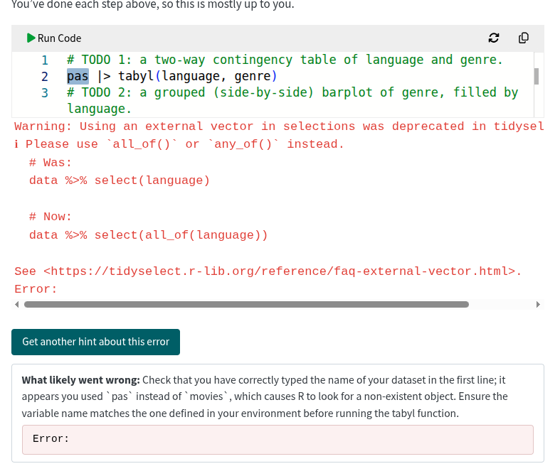{#fig-llm-a}

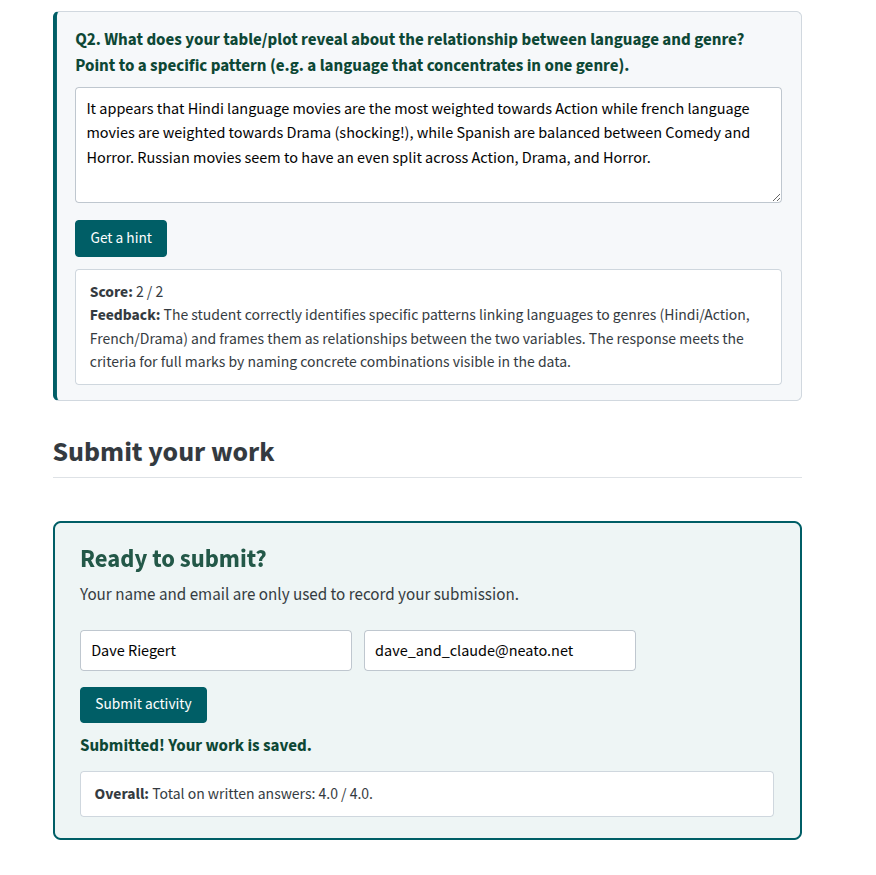{#fig-llm-b}

Screenshots of the LLM prototype by D. Riegert, which is not part of the course skeleton.
:::


## Disclosure statement {.unnumbered}

N. Mudalige, a co-author of this paper, developed the STA258 tutorial website (<https://nishanmudalige.github.io/STA258_Tutorials/>), from which the graded tutorial in Figures [-@fig-exercise] to [-@fig-false-positive] is taken.
The screenshots of the LLM prototype in @fig-llm were provided by co-author D. Riegert.
All other screenshots were taken from the CanCOTS course skeleton, whose materials were contributed by the authors.


## Supplementary material {.unnumbered}

The source of the course skeleton is available at <https://github.com/nishanmudalige/CanCOTS_2025_Interactive_R_Tutorials>, and the rendered site at <https://nishanmudalige.github.io/CanCOTS_2025_Interactive_R_Tutorials/course_skeleton/index.html>.
